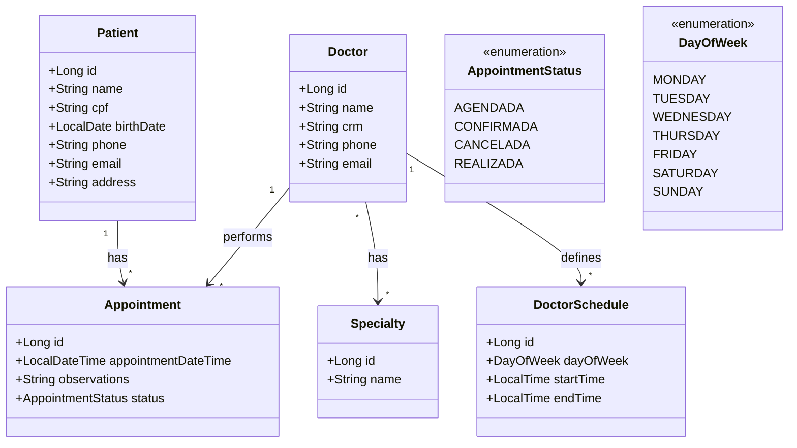

# MedConnect - Sistema de Gestão de Clínica Médica

O MedConnect é um sistema backend desenvolvido com Spring Boot para gerenciar as operações de uma clínica médica. O foco central deste projeto é o agendamento de consultas, o que exige um rigoroso controle de consistência de dados e a implementação de regras de negócio complexas para evitar conflitos de horários entre médicos e pacientes. Este projeto garante a integridade das informações e a validação de regras cruzadas em um domínio complexo.

---

## Funcionalidades Principais

| Funcionalidade | Descrição |
| :--- | :--- |
| **Gestão de Pacientes e Médicos** | Cadastro e consulta de pacientes (por CPF) e médicos (por CRM e especialidade). |
| **Agendamento de Consultas** | Marcação de consultas validando disponibilidade do médico, do paciente e especialidade. |
| **Agenda do Médico** | Definição de horários de atendimento específicos por dia da semana para cada médico. |
| **Controle de Status** | Gerenciamento do ciclo de vida da consulta: AGENDADA, CONFIRMADA, CANCELADA ou REALIZADA. |

---

## Regras de Negócio

* **Sem Conflitos de Horário:** Um médico não pode ter dois pacientes no mesmo horário, e um paciente não pode ter duas consultas simultâneas.
* **Validação de Especialidade:** Só é possível agendar uma consulta se a especialidade solicitada for uma das especialidades cadastradas para o médico.
* **Data Futura:** Consultas só podem ser agendadas para datas e horários futuros.
* **Horário de Atendimento:** O agendamento deve obrigatoriamente cair dentro de uma janela de horário em que o médico esteja disponível na sua agenda.

---

## Estrutura de Entidades Principais

* **Patient:** Dados cadastrais do paciente, com CPF como identificador único de negócio.
* **Doctor:** Dados do médico, incluindo CRM e o relacionamento com suas especialidades.
* **Specialty:** Catálogo de especialidades médicas.
* **Appointment:** A entidade central que vincula paciente, médico e horário, controlando o status da consulta.
* **DoctorSchedule:** Define as janelas de disponibilidade (dia da semana, hora início e fim) para cada médico.

---

## Stack Tecnológica

* **Linguagem:** Java 17+
* **Framework:** Spring Boot 3+
* **Persistência:** Spring Data JPA (Hibernate)
* **Banco de Dados:** PostgreSQL (recomendado para lidar com tipos de data/hora complexos)
* **Documentação:** Springdoc OpenAPI (Swagger UI)
* **Validação:** Jakarta Bean Validation (para CPF, e-mail e datas)

---

## Testes da API

Para validar as regras de negócio e testar a comunicação com a camada de serviço através dos seus *Controllers*, o uso do Postman é uma excelente abordagem. Ele facilitará a submissão de requisições de agendamento e o diagnóstico rápido de erros do servidor (como retornos 500 ou requisições inválidas) quando a lógica de validação for acionada. 

---

## Desafios e Aprendizados

* **Lógica de Agendamento:** Criar métodos de serviço que consultem o banco de dados para verificar sobreposições de horários antes de salvar um novo agendamento.
* **Relacionamentos Many-to-Many:** Gerenciar a relação entre Médicos e Especialidades de forma eficiente.
* **Tratamento de Exceções Customizadas:** Criar exceções como `ScheduleConflictException` para retornar erros claros ao usuário na resposta da API.
* **Testes de Integração:** Escrever testes que tentem forçar agendamentos duplicados para garantir que a lógica de proteção de integridade dos dados está funcionando corretamente.

